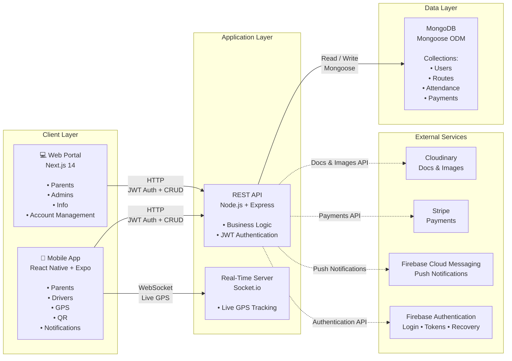

# BusWay Unified Full Stack JavaScript Architecture



---

# Arquitectura por Capas

## 1. Client Layer

### Mobile App
- Framework: React Native + Expo
- Funcionalidades:
  - Padres
  - Conductores
  - GPS en tiempo real
  - Escaneo QR
  - Notificaciones Push

### Web Portal
- Framework: Next.js 14
- Funcionalidades:
  - Padres
  - Administradores
  - Información
  - Gestión de cuentas

---

## 2. Application Layer

### REST API
Tecnologías:

- Node.js
- Express

Responsabilidades:

- Lógica de negocio
- CRUD
- Autenticación JWT

### Real-Time Server

Tecnología:

- Socket.io

Responsabilidades:

- Seguimiento GPS en tiempo real mediante WebSockets.

---

## 3. Data Layer

### MongoDB

Acceso mediante:

- Mongoose ODM

Colecciones:

- Users
- Routes
- Attendance
- Payments

---

## 4. External Services

### Firebase Authentication

Responsabilidades:

- Login
- Tokens
- Recuperación de contraseña

---

### Firebase Cloud Messaging

Responsabilidades:

- Notificaciones Push

---

### Cloudinary

Responsabilidades:

- Almacenamiento de documentos
- Gestión de imágenes

---

### Stripe

Responsabilidades:

- Procesamiento de pagos

---

# Flujo General

```text
Mobile App
        │
        ├──────── HTTP (JWT + CRUD)
        │
Web Portal
        │
        ▼
    REST API (Node.js + Express)
        │
        ├──────── MongoDB (Mongoose)
        ├──────── Firebase Auth
        ├──────── Stripe
        ├──────── Cloudinary
        └──────── Firebase Cloud Messaging

Mobile App
        │
        └──────── WebSocket
                     │
                     ▼
              Socket.io Server
                     │
               Live GPS Tracking
```

# Tecnologías

| Capa | Tecnología |
|-------|------------|
| Mobile | React Native + Expo |
| Web | Next.js 14 |
| Backend | Node.js |
| API | Express |
| Tiempo Real | Socket.io |
| Base de Datos | MongoDB |
| ODM | Mongoose |
| Autenticación | JWT + Firebase Auth |
| Archivos | Cloudinary |
| Pagos | Stripe |
| Notificaciones | Firebase Cloud Messaging |